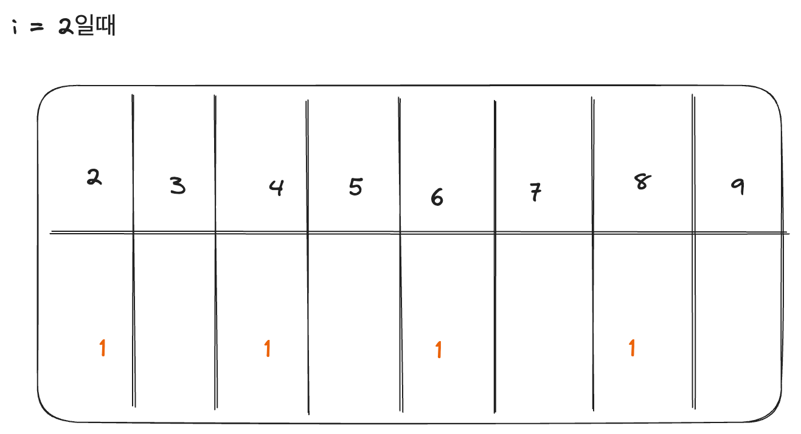
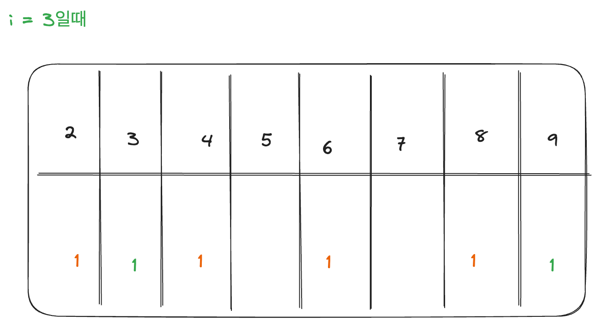

### 소수 - 아리스토테네스체 해설

i가 2일때 다음과 같이 i의 배수들을 모두 돌면서, 소수가 아니라는 표식을 추가한다. (2,4,6,8 ...)



```java
for (int j = i; j <= n; j=j+i) { // j의 배수만 체크 
    arr[j] = 1;
}
```

i가 3일때도 마찬가지로 체크한다. 6의 경우 이미 체크하였으므로 건너뛴다. (3, 9)


